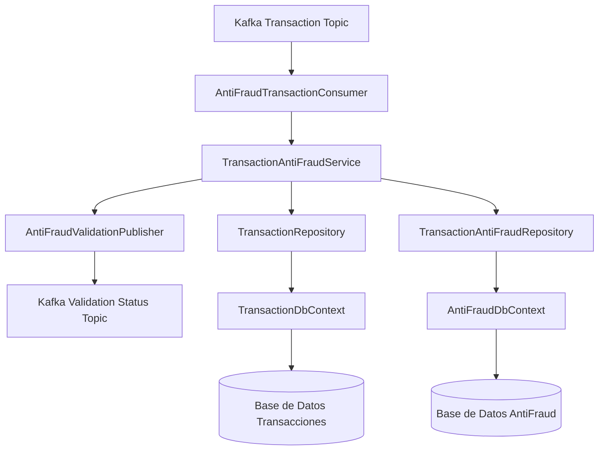
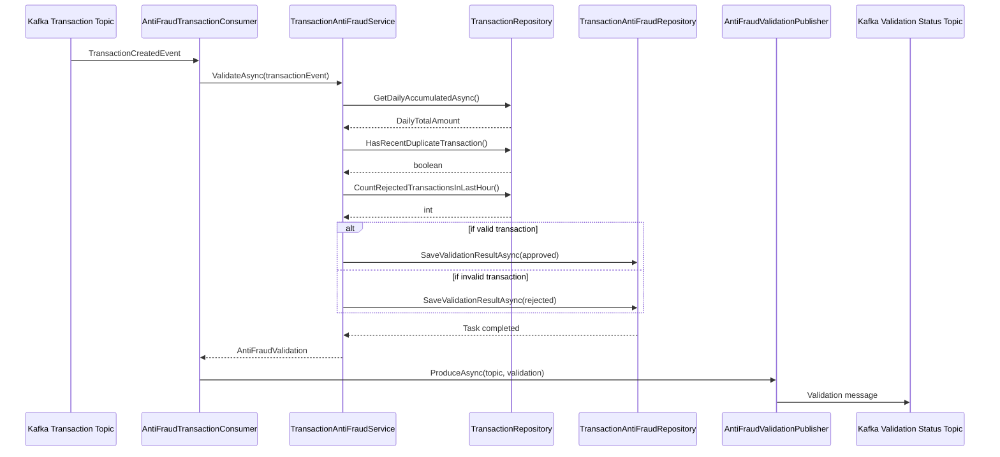

# Documentación Técnica: Sistema AntiFraud

## Índice
1. [Descripción General](#descripción-general)
2. [Arquitectura](#arquitectura)
3. [Diagramas](#diagramas)
   - [Diagrama de Componentes](#diagrama-de-componentes)
   - [Diagrama de Clases](#diagrama-de-clases)
   - [Diagrama de Flujo](#diagrama-de-flujo)
4. [Componentes Principales](#componentes-principales)
   - [Dominio](#dominio)
   - [Aplicación](#aplicación)
   - [Infraestructura](#infraestructura)
5. [Flujo de Procesamiento](#flujo-de-procesamiento)
6. [Decisiones Críticas](#decisiones-críticas)
7. [Configuración y Despliegue](#configuración-y-despliegue)
   - [Docker Compose](#docker-compose)
   - [Servicios Relacionados](#servicios-relacionados)

## Descripción General

El sistema AntiFraud proporciona servicios de validación de transacciones bancarias para detectar y prevenir posibles fraudes en tiempo real. Está diseñado siguiendo los principios de la arquitectura hexagonal (ports and adapters) y utiliza una arquitectura de mensajería basada en Kafka para el procesamiento asíncrono de transacciones.

## Arquitectura

El sistema sigue una arquitectura hexagonal con tres capas principales:

1. **Dominio**: Contiene las entidades de negocio y los objetos de valor que representan los conceptos fundamentales del sistema.
2. **Aplicación**: Implementa la lógica de negocio y define los puertos (interfaces) para comunicarse con sistemas externos.
3. **Infraestructura**: Proporciona implementaciones concretas para los puertos definidos en la capa de aplicación.

## Diagramas

### Diagrama de Componentes



### Diagrama de Clases

```mermaid
classDiagram
    class ITransactionAntiFraudService {
        <<interface>>
        +ValidateAsync(TransactionCreatedEvent) Task~AntiFraudValidation~
    }
    
    class TransactionAntiFraudService {
        -ITransactionRepository _transactionRepository
        -ITransactionAntiFraudRepository _antiFraudRepository
        +ValidateAsync(TransactionCreatedEvent) Task~AntiFraudValidation~
    }
    
    class ITransactionRepository {
        <<interface>>
        +GetDailyAccumulatedAsync(Guid, DateTime) Task~DailyTotalAmount~
        +HasRecentDuplicateTransaction(Guid, Guid, decimal, DateTime) Task~bool~
        +CountRejectedTransactionsInLastHour(Guid) Task~int~
    }
    
    class ITransactionAntiFraudRepository {
        <<interface>>
        +SaveValidationResultAsync(FraudCheckHistory) Task
    }
    
    class IAntiFraudValidationPublisher {
        <<interface>>
        +ProduceAsync(string, AntiFraudValidation) Task
    }
    
    class TransactionRepository {
        -TransactionDbContext _context
        +GetDailyAccumulatedAsync(Guid, DateTime) Task~DailyTotalAmount~
        +HasRecentDuplicateTransaction(Guid, Guid, decimal, DateTime) Task~bool~
        +CountRejectedTransactionsInLastHour(Guid) Task~int~
    }
    
    class TransactionAntiFraudRepository {
        -AntiFraudDbContext _context
        +SaveValidationResultAsync(FraudCheckHistory) Task
    }
    
    class AntiFraudValidationPublisher {
        -IProducer~Null, string~ _producer
        +ProduceAsync(string, AntiFraudValidation) Task
    }
    
    class AntiFraudTransactionConsumer {
        -ITransactionAntiFraudService _transactionAntiFraudService
        -IAntiFraudValidationPublisher _antiFraudValidationPublisher
        -IConsumer~Null, string~ _consumer
        #ExecuteAsync(CancellationToken) Task
        +StopAsync(CancellationToken) Task
    }
    
    class BankTransaction {
        +Guid TransactionId
        +Guid SourceAccountId
        +Guid DestinationAccountId
        +decimal Value
        +DateTime CreatedAt
        +BankTransactionStatus Status
    }
    
    class DailyTotalAmount {
        +decimal Amount
        +DateTime Date
        +DailyTotalAmount(decimal, DateTime)
        +ExceedsLimit(decimal) bool
    }
    
    class FraudCheckHistory {
        +Guid Id
        +Guid TransactionExternalId
        +Guid SourceAccountId
        +decimal Value
        +DateTime CreatedAt
        +BankTransactionStatus Status
        +string? RejectionReason
    }
    
    TransactionAntiFraudService ..|> ITransactionAntiFraudService
    TransactionRepository ..|> ITransactionRepository
    TransactionAntiFraudRepository ..|> ITransactionAntiFraudRepository
    AntiFraudValidationPublisher ..|> IAntiFraudValidationPublisher
    
    TransactionAntiFraudService --> ITransactionRepository
    TransactionAntiFraudService --> ITransactionAntiFraudRepository
    AntiFraudTransactionConsumer --> ITransactionAntiFraudService
    AntiFraudTransactionConsumer --> IAntiFraudValidationPublisher
```



### Diagrama de Flujo



## Componentes Principales

### Dominio

#### Entidades
- **BankTransaction**: Representa una transacción bancaria con propiedades como identidad, cuentas origen y destino, valor, fecha y estado.
- **FraudCheckHistory**: Registra el historial de validaciones de fraude realizadas.

#### Objetos de Valor
- **DailyTotalAmount**: Encapsula la lógica para el seguimiento de montos diarios acumulados y verificación de límites.

#### Enumeraciones
- **BankTransactionStatus**: Define los posibles estados de una transacción (Approved, Rejected).

### Aplicación

#### Servicios
- **TransactionAntiFraudService**: Implementa la lógica de negocio para validar transacciones contra posibles fraudes.

#### Puertos (Interfaces)
- **ITransactionAntiFraudService**: Puerto de entrada para solicitar validaciones de fraude.
- **ITransactionRepository**: Puerto de salida para consultar datos de transacciones.
- **ITransactionAntiFraudRepository**: Puerto de salida para almacenar resultados de validación.
- **IAntiFraudValidationPublisher**: Puerto de salida para publicar resultados de validación.

### Infraestructura

#### Adaptadores de Persistencia
- **TransactionRepository**: Implementa ITransactionRepository para consultar datos de transacciones.
- **TransactionAntiFraudRepository**: Implementa ITransactionAntiFraudRepository para almacenar resultados de validación.
- **AntiFraudDbContext**: Define el contexto de Entity Framework para el acceso a los datos de validación.
- **TransactionDbContext**: Define el contexto de Entity Framework para el acceso a los datos de transacciones.

#### Adaptadores de Mensajería
- **AntiFraudTransactionConsumer**: Servicio que consume mensajes de transacciones desde Kafka.
- **AntiFraudValidationPublisher**: Implementa IAntiFraudValidationPublisher para publicar resultados en Kafka.

## Flujo de Procesamiento

1. **Recepción de Transacciones**: 
   - El AntiFraudTransactionConsumer escucha el tópico de Kafka "transaction-anti-fraud-service-validation".
   - Al recibir un mensaje, lo deserializa en un objeto TransactionCreatedEvent.

2. **Validación de Fraude**:
   - El TransactionAntiFraudService realiza las siguientes validaciones:
     - Verificación de transacciones duplicadas (misma cuenta origen, destino y monto en los últimos 5 minutos).
     - Verificación de múltiples rechazos recientes (3 o más en la última hora).
     - Verificación de límite por transacción (2000 unidades monetarias).
     - Verificación de límite diario acumulado (20000 unidades monetarias).

3. **Registro de Resultados**:
   - Los resultados de validación se guardan en la base de datos a través del TransactionAntiFraudRepository.

4. **Publicación de Resultados**:
   - El resultado de la validación se publica en el tópico "transaction-anti-fraud-service-status-updated" a través del AntiFraudValidationPublisher.

## Decisiones Críticas

1. **Arquitectura Hexagonal**: 
   - **Decisión**: Implementar una arquitectura de puertos y adaptadores.
   - **Justificación**: Facilita el desacoplamiento entre la lógica de negocio y los detalles de implementación, permitiendo cambiar la infraestructura (base de datos, mensajería) sin afectar el dominio.

2. **Procesamiento Asíncrono con Kafka**:
   - **Decisión**: Utilizar Kafka como sistema de mensajería para el procesamiento de transacciones.
   - **Justificación**: Permite un procesamiento escalable y resiliente de las transacciones, con capacidad para manejar picos de carga y recuperarse ante fallos.

3. **Validaciones Específicas de Fraude**:
   - **Decisión**: Implementar reglas específicas de validación (duplicados, límites, múltiples rechazos).
   - **Justificación**: Estas reglas abordan patrones comunes de fraude en transacciones financieras.

4. **Valor Objeto para Monto Diario**:
   - **Decisión**: Encapsular la lógica de acumulación diaria en un objeto de valor DailyTotalAmount.
   - **Justificación**: Proporciona encapsulamiento y garantiza la integridad de los datos relacionados con los montos acumulados.

5. **Registro de Validaciones**:
   - **Decisión**: Almacenar todos los resultados de validación (tanto aprobados como rechazados).
   - **Justificación**: Facilita la auditoría y el análisis posterior de patrones de fraude.

6. **Límites Configurados en el Código**:
   - **Decisión**: Definir límites de transacción como constantes en el servicio.
   - **Justificación**: Simplifica la implementación inicial, aunque idealmente estos valores deberían externalizarse en una configuración para facilitar cambios sin recompilación.

7. **Infraestructura Compartida**:
   - **Decisión**: Compartir la infraestructura (Kafka, PostgreSQL) entre los servicios de Transacciones y AntiFraud.
   - **Justificación**: Optimiza los recursos de infraestructura y simplifica la configuración del entorno de desarrollo.

## Configuración y Despliegue

El sistema se configura y despliega como un servicio de host de .NET:

```csharp
var builder = Host.CreateDefaultBuilder(args)
    .ConfigureServices((hostContext, services) =>
    {
        services.AddDbContext<AntiFraudDbContext>(options =>
            options.UseNpgsql(hostContext.Configuration.GetConnectionString("DefaultConnection")));
        
        services.AddScoped<ITransactionAntiFraudRepository, TransactionAntiFraudRepository>();
        services.AddScoped<IAntiFraudValidationPublisher, AntiFraudValidationPublisher>();
        services.AddScoped<ITransactionAntiFraudService, TransactionAntiFraudService>();
        
        services.AddHostedService<AntiFraudTransactionConsumer>();
    });
```

Las principales configuraciones incluyen:
- **Conexión a Base de Datos**: Configurada a través de la cadena de conexión "DefaultConnection".
- **Configuración de Kafka**: Los servidores de bootstrap se configuran a través de la configuración "Kafka:BootstrapServers" o se utiliza el valor predeterminado "kafka:29092".
- **Registro de Servicios**: Se registran los servicios necesarios con sus implementaciones correspondientes en el contenedor de inyección de dependencias.

### Docker Compose

El sistema utiliza Docker Compose para orquestar los servicios de infraestructura necesarios:

```yaml
version: "3.7"
services:
  postgres:
    image: postgres:14
    ports:
      - "5432:5432"
    environment:
      - POSTGRES_USER=postgres
      - POSTGRES_PASSWORD=postgres
      - POSTGRES_DB=transactions
    volumes:
      - postgres-data:/var/lib/postgresql/data
    networks:
      - my-network
  zookeeper:
    image: confluentinc/cp-zookeeper:5.5.3
    environment:
      ZOOKEEPER_CLIENT_PORT: 2181
    ports:
      - "2181:2181"
    networks:
      - my-network
  kafka:
    image: confluentinc/cp-enterprise-kafka:5.5.3
    depends_on: 
      - zookeeper
    environment:
      KAFKA_ZOOKEEPER_CONNECT: "zookeeper:2181"
      KAFKA_ADVERTISED_LISTENERS: PLAINTEXT://kafka:29092,PLAINTEXT_HOST://localhost:9092
      KAFKA_LISTENER_SECURITY_PROTOCOL_MAP: PLAINTEXT:PLAINTEXT,PLAINTEXT_HOST:PLAINTEXT
      KAFKA_BROKER_ID: 1
      KAFKA_OFFSETS_TOPIC_REPLICATION_FACTOR: 1
      KAFKA_JMX_PORT: 9991
    ports:
      - "9092:9092"
    networks:
      - my-network
volumes:
  postgres-data:
networks:
  my-network:
```

Este archivo Docker Compose proporciona:
- **PostgreSQL**: Base de datos relacional para almacenamiento persistente.
- **Zookeeper**: Servicio de coordinación para Kafka.
- **Kafka**: Plataforma de streaming distribuido para mensajería.

### Servicios Relacionados

La infraestructura de Docker Compose sirve a dos soluciones:
1. **BcpYapeBo.TransactionService**: Servicio encargado del procesamiento de transacciones.
2. **BcpYapeBo.AntiFraudService**: Servicio encargado de la validación de fraudes.

Esta arquitectura de microservicios permite que cada servicio se desarrolle, despliegue y escale de manera independiente, mientras comparten la infraestructura común para comunicación y persistencia.
